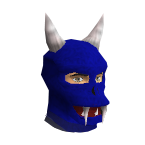

  

<h1 align='center'>
  RSClan-Bot
</h2>

Discord bot for RuneScape 3 communities with up to date information on XP gains, Stats, Adventure logs, and dynamic information from the wiki.

  <a href='https://top.gg/bot/803690098839126016/invite/'>Invite RSClan to your server</a>

  <a href='https://discord.com/invite/9YqrzJex7d'>Discord Server for Help & Feedback</a>

## Commands ⌨️
- `help` - Displays bot commands
- `rsn {rsn}` - Assign a RSN to your Discord account
- `stats {rsn}` - Display user's account levels and experience points
- `gains {rsn}` - Display user's Daily, Yesterday, and Weekly XP Gains
- `ge {item}` - Displays item's current and previous Grand Exchange price
- `spooder` - Displays current Araxxor paths
- `rago` - Displays current and next Vorago rotation
- `alog {rsn}` - Displays user's Adventure Log
- `vis` - Displays current Rune combinations
- `merch` - Displays current and future Travelling Merchant stock
- `raven` - Displays when the Raven will spawn in Prifddinas
- `nemi` - Displays current Nemi Forest Map
- `portables` - Displays currently spawned portables
- `vos` - Displays current Voice of Seren